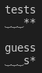
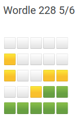
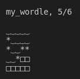

## Command-line version of [Wordle](https://www.powerlanguage.co.uk/wordle/)

Run with `python3 my_wordle.py`
Guess a 5 letter word!
* Note: My algorithm for giving hints (e.g., the `*` characters in my_wordle) differs slightly from the original Wordle's, but is still correct
* E.g., for the secret word `moist` and guess word `tests`, the following examples both hint for the letters `t` and `s`, but in different locations of `tests` :

**Wordle:**

**my_wordle:**

 &nbsp;

where `⏟` indicates gray boxes, `*` indicates yellow boxes, and the actual letters (e.g., `s`) indicate green boxes.

For copying results to Twitter (or other social media), `□` represents correct characters (hidden for others)

* E.g.,

&emsp; &emsp; &emsp; &emsp; &emsp; &emsp; &emsp; &emsp; &emsp; &emsp; &emsp; &emsp;

